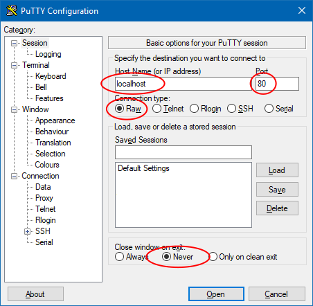
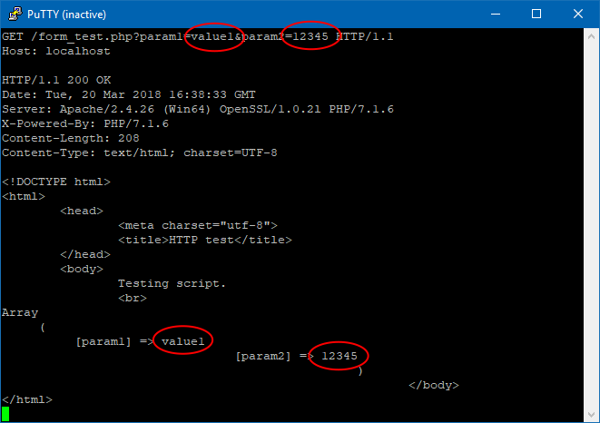
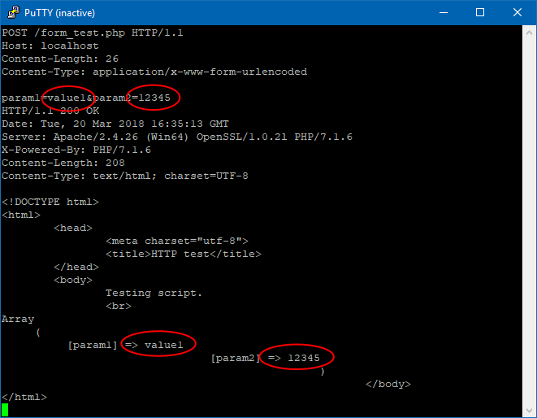

* TOC
{:toc}

[Previous article](/articles/web/) introduced internet communication protocols. This article is going to be a more
in-depth description of HTTP protocol. As I said before, HTTP is text-based and stateless protocol. Each HTTP request is
independent and for successful transfer of data, these steps are required:

- establish connection (client)
- send request (client)
- send response (server)
- terminate connection (server)

HTTP protocol uses plain text and therefore it is not really safe to send any confidential documents or passwords over
the network -- use HTTPS for more secure connections. HTTPS is merely an envelope of HTTP protocol. I will focus on
plain HTTP protocol version 1.x in this article and moreover, on a single HTTP transaction. You already know, that you
need to issue multiple HTTP requests to download contents of one web page.

Dealing with stateless nature of HTTP protocol is described in [following article](/articles/cookies-sessions/).

## Anatomy of request
HTTP request and response have given format:

- headers of request
- body of request (optional)
- headers of response
- body of response (optional)

Imagine HTTP connection as a text file where two systems write characters. To avoid confusion, both systems must obey
given rules. First, the client writes what he wants and then the server writes its response. The connection is closed
afterwards. The steps look like this: 

- client opens connection (finds IP address using DNS)
- the client sends its headers
  - first line contains HTTP method, url and HTTP version (e.g. `GET /file.php HTTP/1.1`)
  - other lines are formatted as `Header-Name: value`
- the client sends one empty line
- if there was `Content-Length` header in the request, client send request body (server waits and counts received bytes)
- the server sends its response headers
  - first line contains numeric response code and message (e.g. `HTTP/1.1 200 OK`)
  - other lines are formatted as `Header-Name: value`
- the server sends one empty line
- (optionally) server sends response body
- the server closes connection

You will notice, that HTTP request and response are much alike, therefore the following descriptions are combinations
of both.

### Request methods
Each HTTP request starts with a *HTTP verb*, most used ones are *GET* and *POST*, but there is a few others (e.g. *PUT*,
*DELETE*, *HEAD*, *OPTIONS*, *PATCH*, *CONNECT* and *TRACE*). HTTP verb says what the client generally want to do with
a resource. Browsers can send different types of requests using `<form>` element with `method` attribute. [Classical
web application](/articles/web-applications/) based on forms uses usually only *GET* and *POST* methods (i.e. it
fetches and stores/modifies data on a server).

{: .note}
Do not be worried, the *DELETE* verb does not actually delete your files in a standard web server, those other verbs
are mainly used by applications to build [REST API](/articles/web-applications/rest-api/). The *CONNECT* verb is used
by HTTP proxy servers to make tunnels.

### Headers
There are many HTTP headers, some of them are specific for the request, some of them are specific for the response and
some of can be used in both. Headers bear information about the request or response and about the payload. They also
contain information about sender and about its capabilities.

To actually see some headers, open 

Typical request headers:

- `Content-Type` -- type of payload
- `Content-Length` -- size of payload, if you plan to send any
- `Cookie` -- client sends stored cookies to server
- `User-Agent` -- signature of client
- `Accept` -- what data types can you client process
- `Accept-Language` -- what language can your client accept (you can set it in browser configuration, this header is
  used to determine language for multi-lingual sites)

Typical response headers:

- `Content-Type` -- type of payload
- `Content-Length` -- size of payload, if you plan to send any
- `Set-Cookie` -- server commands the client to store cookie information 
- `Server` -- signature of server
- `Last-Modified` -- last date of resource modification (used for caching)
- `Location` -- server commands the client to redirect to a new location

You can see that server can tell you browser what to do (store cookies, redirect, to cache or not to cache a file).
The browser is implemented in a way that it obeys server commands. The communication is quiet complicated and sometimes
one HTTP request leads immediately to another.

### Response status codes
[Status codes](https://www.w3.org/Protocols/rfc2616/rfc2616-sec10.html) are used to quickly identify what the server
did or did not. Each HTTP request is responded with one status code. Status codes are numbers from 100 to 5xx. They
are semantically divided into groups:

- 1xx -- informational codes
- 2xx -- server success
- 3xx -- redirection and caching
- 4xx -- error on client side
- 5xx -- error on server side

Well known response codes:

- `200 OK` -- the server says, that everything went OK
- `301 Moved Permanently` -- the server says, that the resource is somewhere else and you should not use this URL anymore
- `304 Not Modified` -- used with caching, the server says that client can use content which it has from previous visit
- `401 Unauthorized` -- to fulfill the request, you need to authorise
- `403 Forbidden` -- it is not allowed to use this URL, event authorisation would not be useful here
- `404 Not Found` -- resource not found
- `500 Internal Server Error` -- the server failed to fulfill the request

### Body of request or response
Body is arbitrary, you should specify `Content-Type` header which specifies the format of body, but it is the
responsibility of the sender to actually pass data in that format. You should also specify `Content-Length` header
if you know how many bytes you will be sending in advance (e.g. file download/upload). If you do not know how many
bytes you will send (e.g. dynamic page generated by PHP script), use `Transfer-Encoding: chunked` header.

## Real HTTP request example
I used [Putty](https://www.putty.org/) client to connect to a public web server on port 80 (without encryption --
no `https://`). Here is a screenshot of Putty if you want to try it at your own. Find a web site which does not use
HTTPS protocol, so you can communicate with it using plain text (you can use homepage of our university -- `mendelu.cz`).

Actual request -- what I wrote into the console (yes, type into the console using your keyboard):

~~~
description       HTTP transmission
METHOD+URL      | GET / HTTP/1.1⏎
REQUEST HEADER  | Host: mendelu.cz⏎
EMPTY LINE      | ⏎
~~~

{: .note}
Notice that empty line on the end of the request. The server waits for an empty line to start responding.

Actual response -- what I received from server:

~~~
description       HTTP transmission
RESPONSE CODE   | HTTP/1.1 200 OK⏎
RESPONSE HEADER | Date: Tue, 20 Mar 2018 09:16:20 GMT⏎
RESPONSE HEADER | Server: Apache/2.2.22 (Ubuntu)⏎
RESPONSE HEADER | X-Powered-By: PHP/5.3.10-1ubuntu3.26⏎
RESPONSE HEADER | Expires: Thu, 19 Nov 1981 08:52:00 GMT⏎
RESPONSE HEADER | Cache-Control: no-store, no-cache, must-revalidate, post-check=0, pre-check=0⏎
RESPONSE HEADER | Pragma: no-cache⏎
RESPONSE HEADER | Set-Cookie: PHPSESSID=64ddm2tg61u1o33j551m87un82; path=/⏎
RESPONSE HEADER | Vary: Accept-Encoding⏎
RESPONSE HEADER | Transfer-Encoding: chunked⏎
RESPONSE HEADER | Content-Type: text/html⏎
EMPTY LINE      | ⏎
RESPONSE BODY   | <!DOCTYPE html>⏎
RESPONSE BODY   | <html lang="cs">⏎
RESPONSE BODY   |     ...⏎
RESPONSE BODY   | </html>
~~~

The *GET* request is used to download information. I need to say what resource I want to receive. In my example, I used
`/`, this means that I want to receive default *index* file for root directory. `Host` header is important for servers
with multiple DNS names. You are connecting to `mendelu.cz`, but internally, your computer queries DNS system and
obtains IP address of that machine (195.178.72.2 at the time of writing this article), the connection is opened but
the server does not know, which domain name you used to obtain his IP address. You have to tell him using `Host`
header. The server can host many presentations with different domains, it has some mapping between hostname and server
file system configured and the `Host` header is used to determine correct folder with presentation. This feature is
called *vhosts* in [Apache HTTP server](https://httpd.apache.org/) and is a matter of configuration.

## When to use *GET* or *POST* method?
Use *GET* method for actions like:

- general navigation from page to page
- search or filtering
- change of order
- pagination
- pass required parameters (such as ID of record) to **display** a form
- when you want to allow visitor to save/share URL

Use *POST* method for actions like:

- register a user
- send an email
- insert or update of a record
- deletion of a record
- login and even logout to prevent [CSRF](/articles/security/csrf/)
- generally, modifications of data in a database (one-time actions)

There can be exceptions, but they have to be justified.

## Value passing in HTTP requests
The biggest difference is that *GET* request should not have a request body and therefore you should pass all parameters
required to obtain the resource in URL. The HTTP protocol itself does not really bother with recognizing what is *path*
and what is *parameter* in the URL, but you have to avoid confusion -- URL should not contain spaces and special
characters, only ASCII characters and some selected special characters like `=`, `?`, `&` are allowed. Therefore you
have to use [URL encoding or percent encoding](https://en.wikipedia.org/wiki/Percent-encoding) to encode the URL
(there are some variations to this encoding -- e.g. space is `%20` or `+`).

For example, you should not send requests like this: 

~~~
GET /script.php?query=searching for something with spaces HTTP/1.1⏎
Host: server.com⏎
⏎
~~~

But like this:

~~~
GET /script.php?query=searching+for+something+with+spaces HTTP/1.1⏎
Host: server.com⏎
⏎
~~~

{: .note}
When a browser generates request from a form fields, it encodes the values automatically, contrary, when you generate
URLs in a PHP or in a template, you should have the URL encoding in mind. There is a PHP [urlencode()](http://php.net/manual/en/function.urlencode.php)
function for this. There is no need to worry when you only use numeric values as parameters (e.g. IDs of entities).

The query string in URL has format specified by `application/x-www-form-urlencoded` content type. It simply says
that you should pass name-value pairs in format `name=value` divided by `&` when you need to pass more than one
pair. Compare following examples and notice, that both methods use same `name=value` format but for *GET* method,
the string is appended to URL as query (after `?`) and for *POST* method, the string is actually a body of request.

*GET* example:

~~~
GET /form_test.php?param1=value1&param2=12345 HTTP/1.1⏎
Host: localhost⏎
⏎
~~~

*POST* example:

~~~
POST /form_test.php HTTP/1.1⏎
Host: localhost⏎
Content-Length: 26⏎
Content-Type: application/x-www-form-urlencoded⏎
⏎
param1=value1&param2=12345⏎
~~~

The response is an output of simple PHP script which prints its inputs formatted as HTML code.

## Summary
I described HTTP 1.x protocol in this article with focus on a single HTTP transaction. Remember, that HTTP is a
text-based, stateless protocol, which has many disadvantages for web applications. On the other hand, it is very easy
to communicate using the HTTP protocol.

### New Concepts and Terms
- GET method
- POST method
- body or payload of request/response
- `application/x-www-form-urlencoded`
- using GET and POST
