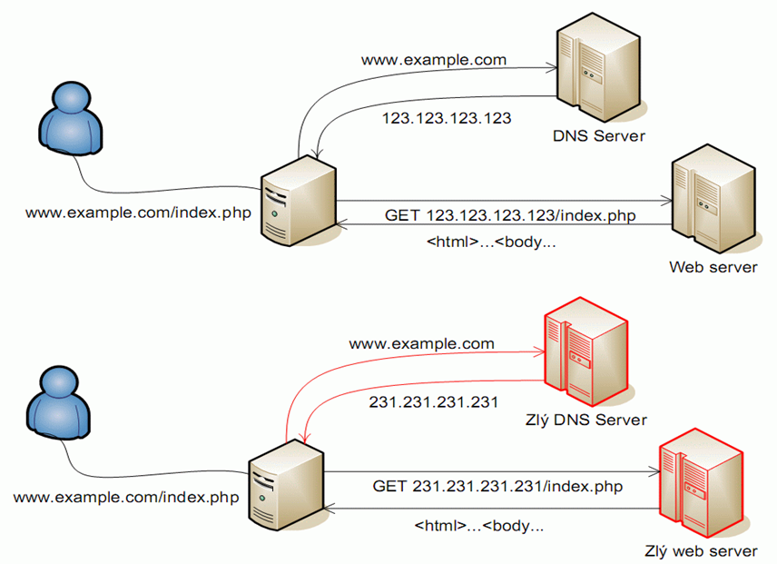

<section markdown='1'>
## Web Applications
- Web Application is composed of Web pages
- Technically web pages, but has:
  - Much more Interactions,
  - Much higher number of requests,
  - Database,
  - Concurrency problems.
- Web application is a **server** application:
  - You can kill the server,
  - You kill it for everyone.
</section>

<section markdown='1'>
## Web Applications
- Differences to local applications:
  - remote access,
  - managing application state,
  - dependency on client implementations,
  - high availability,
  - much easier updated and deployment,
  - continuous integration 
</section>

<section markdown='1'>
## Remote Access = Security
- Problem no. 1: 
  - End User

- Problem no. 2:
  - Protect against common attacks
- Problem no. 3:
  - Manage application state
- Problem no. 4:
  - Validate user inputs
- Problem no. 5:
  - Encryption  
</section>

<section markdown='1'>
## Password
- **Shared password is bad password**:
  - Every application must have its own,
  - Use KeePass, 1Password, ....
- Cat name is bad password,
  - Unless his name is XdTg42W.
- Password difficult to remember is bad password.
- Complexity:
  - good langauge = 250 000 words
  - 8 characters (A-Za-z0-9) = 6 553 600 000 000 combinations
  - 10 characters = 10 485 760 000 000 000 combinations
- [https://imgs.xkcd.com/comics/password_strength.png](or this)  
</section>

<section markdown='1'>
## Login
- authentication -- validating user **identity**
- authorization -- validating user **permissions**
- authentication -- does not exist
- four factors for validating user identity:
  - you know it (password -- easiest)
  - you have it (key, certificate -- also good)
  - who you are (face, fingerprint, DNA -- hard to get precisely)
  - what you do (signature, voice -- may be faked)
- 2F (two-factor) validation
</section>

<section markdown='1'>
## Attack

</section>

<section markdown='1'>
## Encryption
- Encryption is done through HTTPS protocol,
  - Wrapper around HTTP (fully compatible).
- It is necessary to avoid MIM attack:
  - To verify page origin, certificates are used:
    - certificate must be valid,
    - certificate must be for current server,
    - certificate must be verified by certificate authority
    - certificate authority must be verified
</section>

<section markdown='1'>
## Certificate
- Verified by Certificate Authority
  - Root certificates are installed in OS / Browser 
  - self-signed certificates for testing purposes
- Standard certificate
  - verifies identity of the server
- Extended certificated
  - verifies identity of the server owner as well    
</section>

<section markdown='1'>
## Password
- Password transmitted through HTML forms is sent un-encrypted
  - HTTPS is a must
- Password must be stored encrypted / hashed in database:  
  - When 'salted' a slow one-way hash algorithm (SHA256, Whirlpool) is fine,
  - The attacker will attack some other part of the application
  - It is safer to use one-way encryption algorithm (PHP crypt, generate_password()).
- If possible avoid two-way algorithms or storing key.
- Don't forget permissions to the database.
</section>

<section markdown='1'>
## Common attacks
- SQL injection
  - Caused by wrong escaping of values in SQL queries
  - Dangerous characters: quotes, #0 and some other
  - Prepared statements are the solution
- XSS (Cross site scripting)
  - Cause by wrong escaping of values in HTML code
  - Dangerous characters: <>, quotes, and many more
  - Templates are the solution
</section>

<section markdown='1'>

</section>
