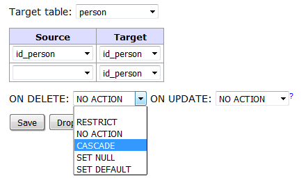

* TOC
{:toc}

This section is dedicated to teach you how to delete database entries.
To delete something in database is permanent and cannot be undone unless you have a database
backup. Be careful about what you delete.

Syntax of [SQL `DELETE`](/en/apv/walkthrough/database/#delete) command is already familiar to you.
One think you should think of is how to determine which rows to delete. Most common action
is deletion of a single row. You know that each table should have a primary key which identifies
each row with unique value or set of values. You should therefore use it to delete rows.

I have seen students who tried to construct delete function by using `first_name` and `last_name`
to search for person record to delete. These people did not consider that these two properties
of a person can be shared among many records in database (there is unique key on `first_name`,
`lastname` and `nickname` columns). Such way of deleting records can have unwanted side effects.

Before you allow users of your application to modify or even delete information, you should first
take steps to [authenticate](/en/apv/walkthrough/login) and authorize them.

## Getting started
We will create a PHP script which will handle deletion of a person when we supply suitable
parameter. This parameter should be primary key of a row you want to delete -- only one number.

We can create simple form with `<input type="number">` to test this function and a small backend
script which will execute `DELETE` SQL query.

Latte template with form:





PHP script with `DELETE` SQL command:





OK, this works but it is not very useful. Users of your application do not understand primary keys
and they do not want to remember some ID value which they have to type into a form. They want to see
list of persons and a nice delete button which they just click.

### Task -- Make a delete button 
Extend your script which lists all persons with a delete button. Change that `<input type="number">`
we used in previous example to `type="hidden"` and put this form in every row of users list.
Pass value of `id_person` in that hidden field. Remember to extend `SELECT` SQL command to
retrieve `id_person`.

{: .solution}




### Confirm delete
Take a look at [JavaScript](/en/apv/walkthrough/javascript) article to extend your form with
confirmation popup. It is a good idea to let user confirm deletion of important information first
because this action cannot be undone.

## Deleting records which are referenced by other records
There are [foreign keys](/en/apv/articles/relational-database/#foreign-key) between person table
and other tables (person is referenced in `relation` or `contact` tables). When you take a look
at *Foreign keys* section of table details in Adminer, you can see that there is `NO ACTION` under
`ON DELETE` event:

 
This means that if you try to delete a person entry, information about his contacts
have no defined behaviour. It is not meaningful to store contact entries which do not belong to any
person. We should therefore set that `ON DELETE` behaviour to `CASCADE`:

You should change this in every table which references `person` table, otherwise you won't be able
to delete persons with related entries in those tables.

In other cases you might prefer to break relation instead of deleting related entries. It is an example
of `location` -- `person` relationship. When we delete an address which is used by a person we
rather set that `ON DELETE` behaviour of `id_location` foreign key in `person` table to `SET NULL` instead
of `CASCADE` to preserve a person (only from now we will not know where he lives anymore). To be able
to do this, `id_location` column must support storing NULL value.

There is also another options like `RESTRICT` or `SET DEFAULT` which are self explanatory (I hope).

## Delete or hide?
Sometimes you may wish to access "deleted" information even after you remove it. It might be helpful in our
app to just hide persons we do not want to see in person list and still be able to display such persons
participation in meetings. To achieve this behaviour you should add a column (e.g. `deleted`, data-type of this
column can be `datetime` with possibility of NULL value -- NULL means that a person is not deleted and
date and time can be used to store time when that person was deleted). Then you should update your
SQL queries which retrieve persons from database according to your needs.

## Summary
You now know how to delete records from a database and that because of foreign keys which are used to guard
consistency of data you need to think what to do with dependent records -- whether to delete them along
or leave them in database while removing link to deleted record.

### New Concepts and Terms
- Delete
- Foreign keys